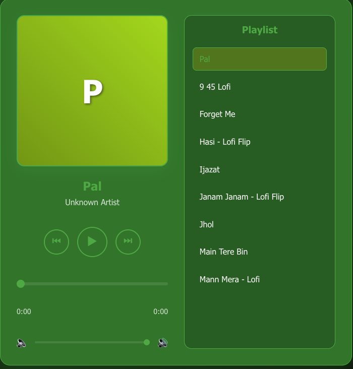
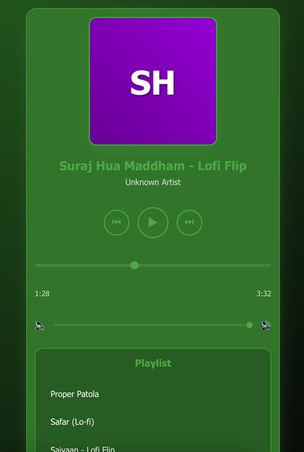
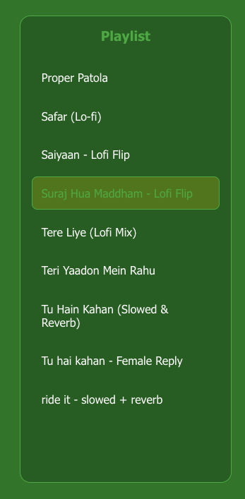
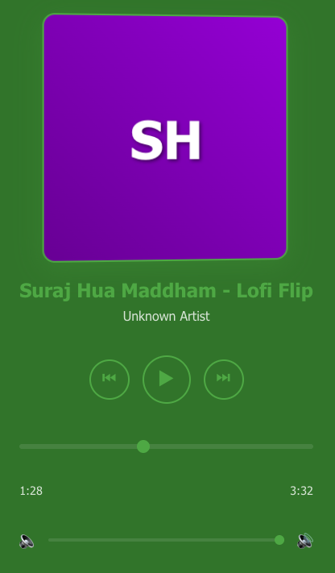

# Modern Music Player

A sleek and modern music player built with React, featuring a beautiful green theme and smooth animations.

## Screenshots

### Main Player View

*The main player interface showing the current song, controls, and playlist*

### Mobile View

*Responsive design on mobile devices*

### Playlist View

*The playlist section with song list and current song highlight*

### Player Controls

*Detailed view of player controls and progress bar*

## Features

- 🎵 Play/Pause, Next/Previous track controls
- 📱 Responsive design that works on all devices
- 🎨 Beautiful green theme with modern UI elements
- 📋 Always-visible playlist with easy song selection
- 🔊 Volume control with visual feedback
- ⏱️ Progress bar with seek functionality
- 🎨 Dynamic cover art generation based on song titles
- 🔄 Automatic playlist management
- 🎯 Clean and intuitive user interface

## Tech Stack

- React.js
- CSS3 with modern features
- Node.js backend
- Express.js server

## Getting Started

### Prerequisites

- Node.js (v14 or higher)
- npm (v6 or higher)

### Installation

1. Clone the repository:
```bash
git clone https://github.com/yourusername/music-player.git
cd music-player
```

2. Install dependencies:
```bash
npm install
```

3. Start the backend server:
```bash
cd backend
npm install
node server.js
```

4. In a new terminal, start the frontend:
```bash
cd ..
npm start
```

5. Open your browser and visit `http://localhost:3000`

## Project Structure

```
music-player/
├── backend/
│   ├── public/
│   │   └── songs/        # MP3 files
│   └── server.js         # Backend server
├── src/
│   ├── App.js           # Main application component
│   ├── App.css          # Styles
│   └── index.js         # Entry point
└── package.json
```

## Features in Detail

### Player Controls
- Play/Pause toggle
- Next/Previous track navigation
- Volume control with slider
- Progress bar with seek functionality

### Playlist
- Always visible playlist
- Current song highlighting
- Easy song selection
- Smooth scrolling

### UI/UX
- Modern green color scheme
- Smooth animations and transitions
- Responsive design for all screen sizes
- Dynamic cover art generation
- Glassmorphic design elements

## Contributing

1. Fork the repository
2. Create your feature branch (`git checkout -b feature/AmazingFeature`)
3. Commit your changes (`git commit -m 'Add some AmazingFeature'`)
4. Push to the branch (`git push origin feature/AmazingFeature`)
5. Open a Pull Request

## License

This project is licensed under the MIT License - see the LICENSE file for details.

## Acknowledgments

- Icons from Material Icons
- Fonts from Google Fonts
- Inspiration from modern music streaming platforms
